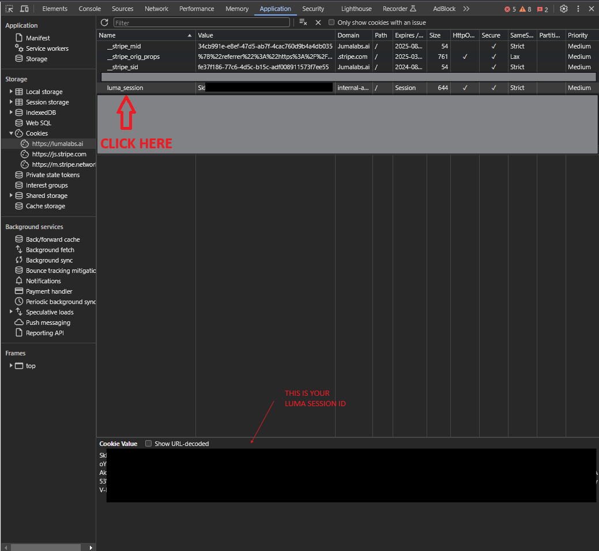

# NodeDreamMachineAPI

NodeDreamMachineAPI is a TypeScript/JavaScript library for interacting with the Luma Labs AI Dream Machine API. It provides an easy-to-use interface for generating AI-powered videos and images.

## Installation

You can install the package using npm or pnpm:

```bash
npm install node-dream-machine-api
```

or

```bash
pnpm install node-dream-machine-api
```

## Usage

First, import the `NodeDreamMachineAPI` class:

```typescript
import { NodeDreamMachineAPI } from 'node-dream-machine-api';
```

Then, create an instance of the API with your access token:

```typescript
const api = new NodeDreamMachineAPI('your luma_session here');
```

To find your luma session id, you need to:

1. Login to lumalabs.ai
2. Right click on the page and click "inspect"
3. Go to Application in the dev tools
4. Find "https://lumalabs.ai under cookies
4. Click on luma_session
5. Copy the cookie value - that is your luma session id!





## API Reference

### `make(options: MakeOptions)`

Generate a new video or image based on the provided options.

Parameters:
- `options: MakeOptions`
  - `prompt: string` - The text prompt for generation
  - `imgFile?: string` - Path to an optional input image file
  - `imgEndFile?: string` - Path to an optional end image file
  - `aspectRatio?: string` - Optional aspect ratio for the generated content

Returns: A Promise that resolves with the generation result.

Example:
```typescript
const result = await api.make({
  prompt: "A serene lake surrounded by mountains",
  aspectRatio: "16:9"
});
```

### `refresh(options?: RefreshOptions)`

Retrieve a list of recent generations.

Parameters:
- `options?: RefreshOptions`
  - `offset?: number` - Starting index for pagination (default: 0)
  - `limit?: number` - Number of items to retrieve (default: 10)

Returns: A Promise that resolves with a list of recent generations.

Example:
```typescript
const recentGenerations = await api.refresh({ limit: 5 });
```

### `getVideoDownloadUrl(videoId: string)`

Get the download URL for a generated video.

Parameters:
- `videoId: string` - The ID of the generated video

Returns: A Promise that resolves with the video download URL.

Example:
```typescript
const downloadUrl = await api.getVideoDownloadUrl("video_id_here");
```

## Note on File Upload Functionality

The file upload functionality (`imgFile` and `imgEndFile` in the `make` method) is only available in Node.js environments. Attempting to use these features in a browser environment will result in an error.

## Error Handling

All methods may throw errors if the API request fails or if invalid parameters are provided. It's recommended to use try-catch blocks or `.catch()` methods when calling these functions.

Example:
```typescript
try {
  const result = await api.make({ prompt: "A futuristic city" });
  console.log(result);
} catch (error) {
  console.error("An error occurred:", error);
}
```

## Contributing

Contributions are welcome! Please feel free to submit a Pull Request.

## License

[MIT License](LICENSE)